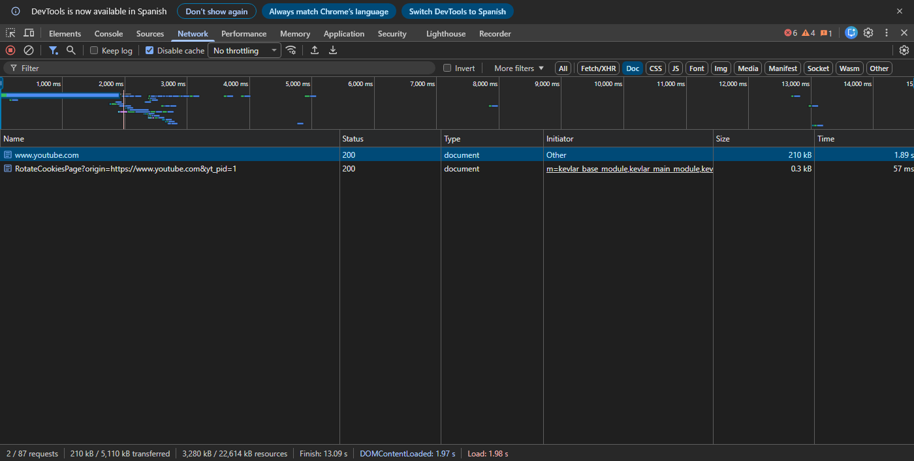
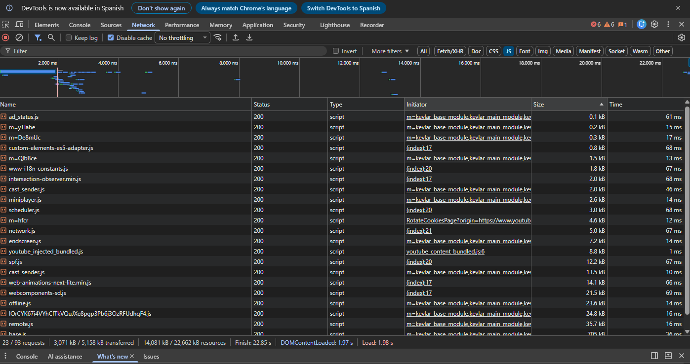
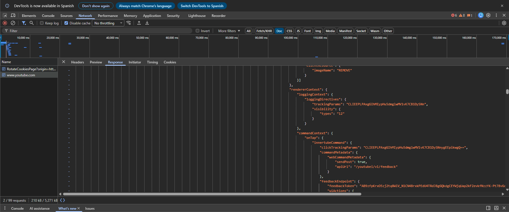
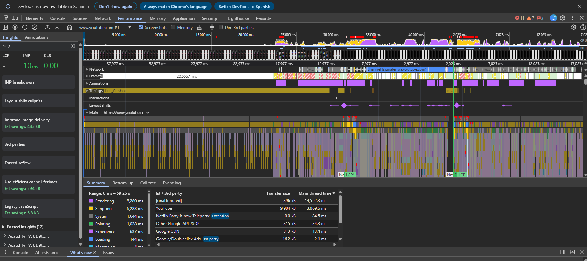
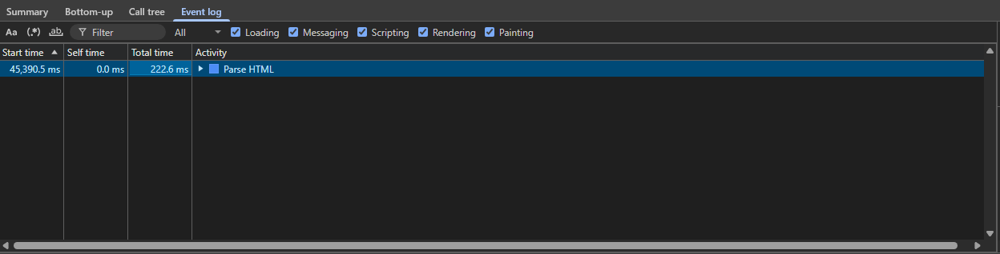
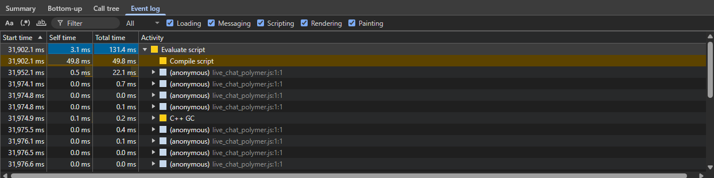
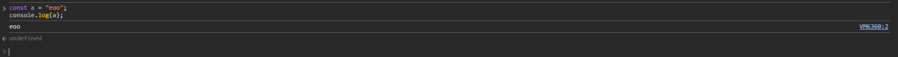
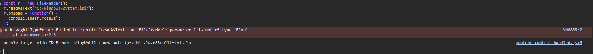

# Actividad 1: Laboratorio de Auditoría y Rendimiento Web

**Web analizada:** YouTube  
**Herramienta utilizada:** Google Chrome DevTools

## 1. Auditoría de Red (Network)

Para empezar, recargué YouTube con la caché desactivada y fui a la pestaña **Network**. Filtré por **Doc** para ver solo el documento HTML principal y me salió que pesa unos **210 kB**.



Luego cambié el filtro a **JS** para ver los archivos JavaScript que se descargan. En total había unos **3.071 kB transferidos** y los recursos JavaScript en memoria llegaban a **14.081 kB**. Es una cantidad enorme de JavaScript.



Después miré la pestaña **Response** del HTML principal para ver qué mandaba el servidor exactamente. Lo que vi es que el HTML ya venía con bastante estructura y datos. Por eso YouTube usa un modelo **híbrido**: el servidor manda algo renderizado (**SSR**) y luego el JavaScript en el navegador se encarga de completar y actualizar la página (**CSR**).



## 2. Performance: funcionamiento del motor JavaScript

Hice una grabación de rendimiento de unos segundos mientras navegaba por YouTube. En la línea de tiempo del hilo principal pude ver varias fases interesantes.

La primera que noté fue **Parse HTML**, que tardó unos **222,6 ms**. Básicamente es cuando el navegador lee el HTML y va construyendo el árbol DOM.



También aparecen **Evaluate script** y **Compile script**. En mi captura, `Evaluate script` tardó unos **131,4 ms** y `Compile script` unos **49,8 ms**. Aquí lo que pasa es:

- **Parse HTML:** el navegador lee el HTML y monta el DOM.
- **Compile script:** el motor de JavaScript (en este caso V8) prepara y compila el código para poder ejecutarlo.
- **Evaluate script:** ya con el código compilado, el motor lo ejecuta y ahí es donde se activa toda la lógica de la web.




## 3. Console y Sandbox

Primero probé a ejecutar algo simple en la consola:

```javascript
const a = "eoo";
console.log(a);
```

Funcionó sin problema, salió `eoo` en la consola tal cual.

Después quise probar los límites del navegador e intenté leer un archivo del disco directamente con `FileReader`:

```javascript
const r = new FileReader();
r.readAsText("C:/Windows/system.ini");
r.onload = function() {
  console.log(r.result);
};
```

El navegador me lanzó este error:

`Failed to execute 'readAsText' on 'FileReader': parameter 1 is not of type 'Blob'.`



Esto tiene sentido porque el navegador funciona dentro de un **Sandbox**, que básicamente es una caja de seguridad que aísla el código JavaScript del sistema operativo. No puedes leer archivos del disco directamente desde una web, el usuario tiene que elegirlos él mismo. Si no existiera esta protección, cualquier página podría leer tus archivos sin que te enteraras, lo cual sería un problema de seguridad enorme.

## 4. Análisis de Bloqueo

Buscando en la pestaña **Network** y ordenando los archivos JS por tamaño, encontré scripts que superan **1 MB**. Uno de los que aparecía pesaba unos **2,18 MB**.



Si el navegador tuviera que descargar y ejecutar ese script de forma **síncrona** (es decir, esperando a que termine antes de hacer nada más), la página se quedaría completamente congelada durante ese tiempo. El usuario vería una pantalla en blanco y no podría hacer nada.

Por suerte, JavaScript en el navegador funciona de forma **asíncrona** y tiene un **Event Loop** que va repartiendo las tareas. Así puede ir descargando el script en segundo plano mientras sigue renderizando la página y respondiendo a lo que hace el usuario, sin que se note ningún bloqueo.

## Conclusión

Con esta práctica he podido ver de primera mano cómo funciona YouTube por dentro. Usa muchísimo JavaScript, depende de CSR para gran parte de su interfaz, el motor V8 compila y evalúa el código en tiempo real, el Sandbox protege al usuario de accesos no autorizados al sistema, y gracias a la asincronía todo esto funciona sin que la página se congele.
