# Actividad 2: El Gran Duelo de la Integración (defer vs async vs modules)

**Objetivo:** Comprobar de forma empírica con las DevTools cómo afecta la forma de cargar JavaScript al renderizado de la página, al tiempo en pintar la pantalla en blanco y al acceso al DOM.

---

## 1. Configuración del Entorno y Código

He creado un entorno de pruebas con un `index.html` que contiene un `<h1 id="titulo">Hola</h1>` y tres scripts pesados (`script1.js`, `script2.js` y `script3.js`).

Para simular que los scripts tardan en ejecutarse y cargan el hilo principal, cada uno tiene un bucle `for` de 500 iteraciones antes de intentar modificar el título:

```javascript
console.log("Inicio script 1");

// Bucle pesado de 500 iteraciones
for (let i = 0; i < 500; i++) {
    console.log(`[script1] iteración ${i}`);
}

const titulo1 = document.getElementById('titulo');
if (titulo1) {
    titulo1.innerText = 'Cambiado por Script 1';
    console.log("Éxito: Script 1 modificó el título");
} else {
    console.error("Error: El DOM aún no se ha construido (script1)");
}
```

---

## 2. Análisis de los 5 Escenarios

### Escenario A: Script tradicional en `<head>`

Colocamos `<script src="script1.js">` en la cabecera sin ningún atributo.

- **Pestaña Network:** Se observa la carga de `escenario-a.html` y de los tres archivos JavaScript (`script1.js`, `script2.js` y `script3.js`). Todos los recursos se descargan correctamente con código de estado HTTP `200`. Al tratarse de scripts tradicionales situados en el `<head>`, el navegador debe ejecutar cada script cuando lo encuentra antes de continuar procesando el HTML, por lo que su ejecución bloquea temporalmente el parser.
- **Tiempos y Pantalla en blanco (Performance):** El navegador congela el HTML (Render-blocking) para ejecutar el JavaScript. La tarea `Evaluate script` dura **5,24 ms** y se ejecuta mucho antes de pintar nada, dejando la pantalla totalmente en blanco.
- **Disponibilidad del DOM:** **Falla.** Como el navegador aún no ha llegado a leer el `<body>`, `document.getElementById('titulo')` devuelve `null` y da error.

**Captura Network:**

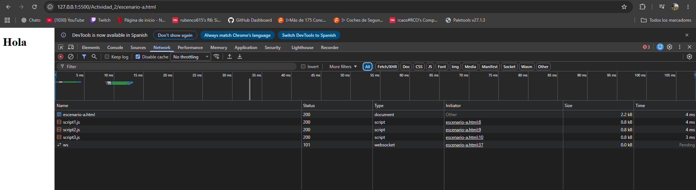

**Captura Performance:**

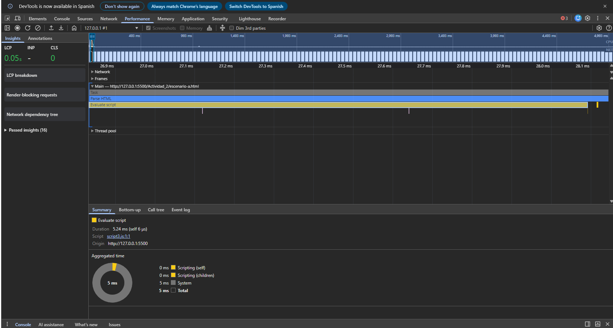

**Captura Console:**

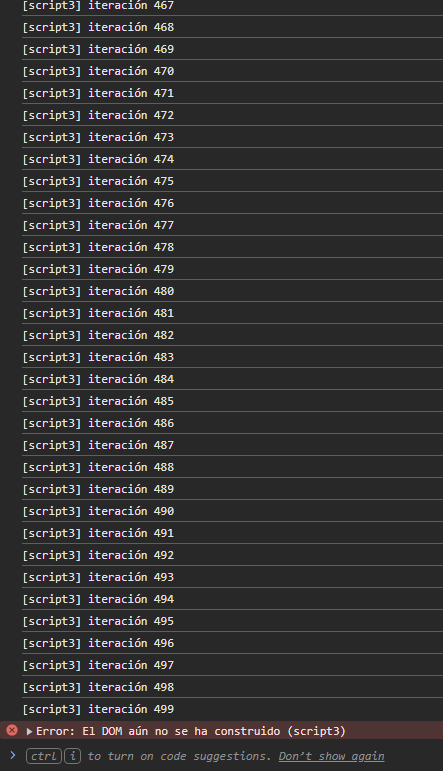

---

### Escenario B: Script al final del `<body>`

Colocamos los scripts tradicionales justo antes de cerrar `</body>`.

- **Pestaña Network:** Se observa la carga de `escenario-b.html` junto con `script1.js`, `script2.js` y `script3.js`, todos con estado HTTP `200`. En este caso las etiquetas `<script>` están situadas al final del `<body>`, por lo que cuando el navegador llega a ellas ya ha procesado el contenido HTML anterior, incluido el `<h1>`. Los scripts se ejecutan en el orden en el que aparecen en el documento.
- **Tiempos y Pantalla en blanco (Performance):** El navegador procesa primero el HTML y pinta el título original ("Hola") muy rápido. Después se ejecuta `Evaluate script` (**5,48 ms**).
- **Disponibilidad del DOM:** **Funciona.** El elemento ya existe en el DOM, por lo que los scripts lo modifican en orden hasta dejar *"Cambiado por Script 3"*.

**Captura Network:**

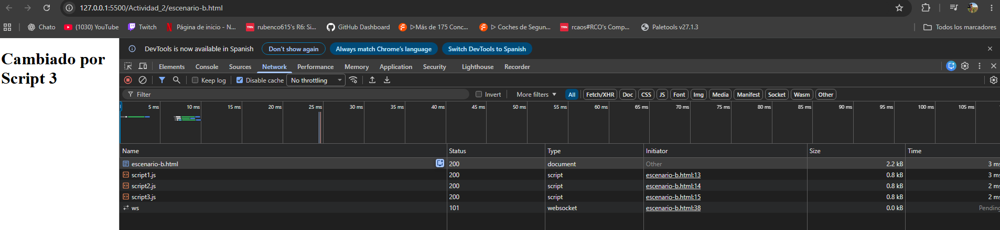

**Captura Performance:**

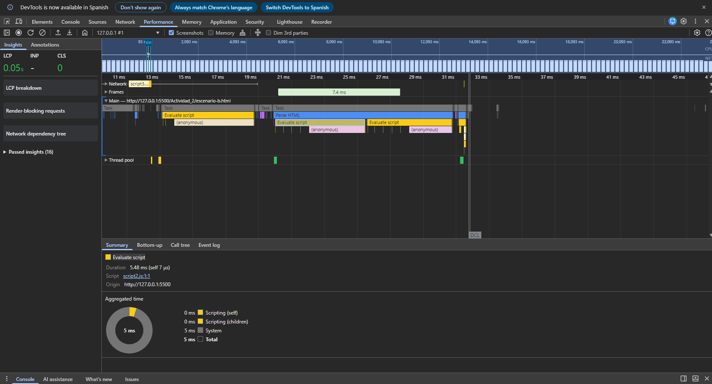

**Captura Console:**

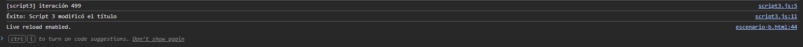

---

### Escenario C: `<script async>` en el `<head>`

Añadimos el atributo `async` a cada script en el `<head>`.

- **Pestaña Network:** Se observan las peticiones de `script1.js`, `script2.js` y `script3.js` realizadas mientras continúa la carga del documento. Los tres archivos se descargan de manera independiente y todos responden con estado HTTP `200`. Con `async`, cada script puede ejecutarse en cuanto termina de descargarse, por lo que no existe garantía de que se ejecuten en el mismo orden en el que aparecen en el HTML.

  En esta ejecución concreta el resultado final fue **"Cambiado por Script 3"**, pero esto no significa que `async` garantice el orden `1 → 2 → 3`; con otras condiciones de red o archivos de distinto tamaño el orden podría variar.

- **Tiempos y Pantalla en blanco (Performance):** La descarga no bloquea, pero en cuanto un archivo termina se ejecuta de inmediato (en mi prueba duró **5,50 ms**), interrumpiendo el navegador.
- **Disponibilidad del DOM:** **Inestable.** No espera al DOM. Si el script se descarga antes de que el navegador lea el `<h1>`, falla. Al ser una página tan simple dio tiempo a encontrarlo, pero en una web real no está garantizado.

**Captura Network:**

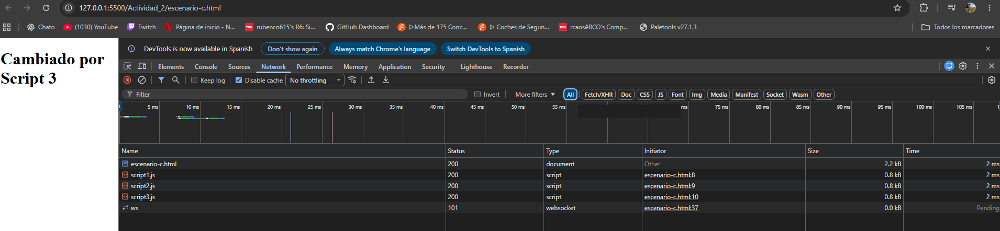

**Captura Performance:**

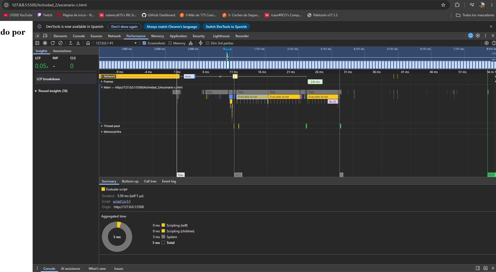

**Captura Console:**

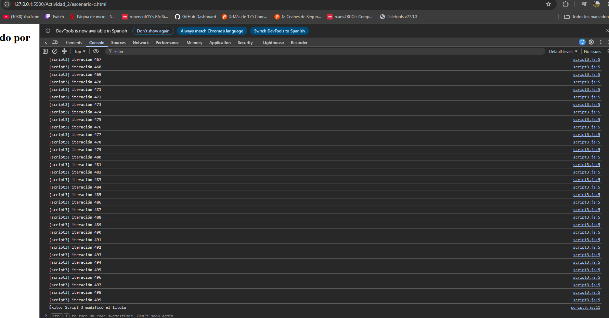

---

### Escenario D: `<script defer>` en el `<head>`

Añadimos el atributo `defer` a cada script en el `<head>`.

- **Pestaña Network:** En Network se observa que `script1.js`, `script2.js` y `script3.js` pueden descargarse mientras el navegador continúa procesando el documento HTML. Los tres recursos se cargan correctamente con estado HTTP `200`.

  A diferencia de `async`, `defer` retrasa la ejecución hasta que el documento HTML ha terminado de analizarse y conserva el orden establecido en el código (`script1.js` → `script2.js` → `script3.js`). Por ello, el resultado final mostrado es **"Cambiado por Script 3"**.

- **Tiempos y Pantalla en blanco (Performance):** No hay retraso en el pintado inicial. Los scripts esperan a que el DOM esté completamente construido y se ejecutan justo antes de `DOMContentLoaded`. En mi prueba `Evaluate script` tomó **6,09 ms**.
- **Disponibilidad del DOM:** **Funciona siempre.** Garantiza que el DOM ya existe y respeta el orden estricto (1 → 2 → 3).

**Captura Network:**

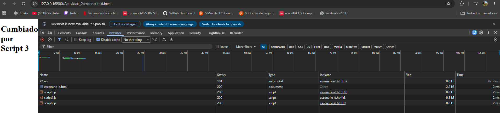

**Captura Performance:**

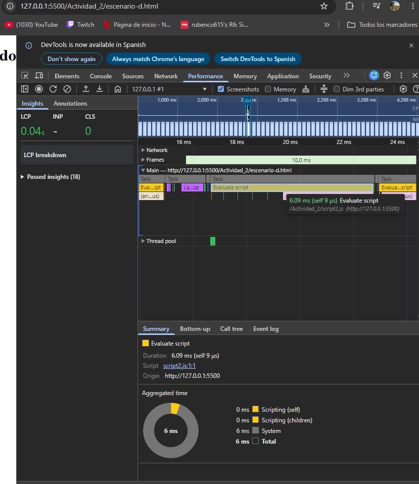

**Captura Console:**

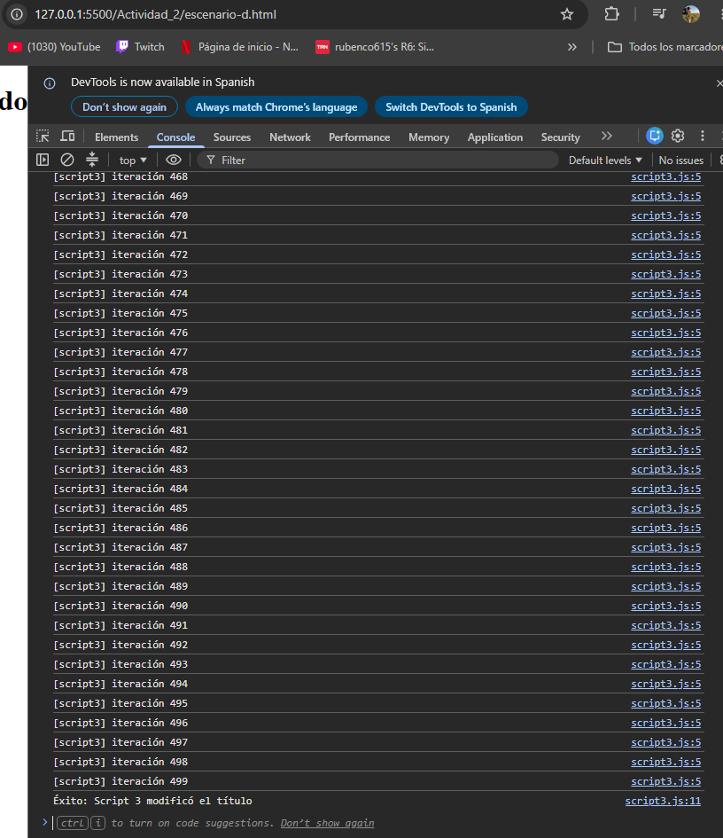

---

### Escenario E: `<script type="module">` en el `<head>` (ES6 Modules)

Cargamos los scripts como módulos nativos con `type="module"`.

- **Pestaña Network:** Se observa la carga de los tres archivos JavaScript como recursos de tipo `script`, todos con estado HTTP `200`. Los scripts `type="module"` pueden descargarse mientras el navegador continúa procesando el HTML y, por defecto, su ejecución queda diferida hasta después del análisis del documento.

  Los módulos se están ejecutando mediante un servidor HTTP local (`127.0.0.1:5500`), lo que proporciona el entorno adecuado para trabajar con ES Modules y sus posibles dependencias mediante `import` y `export`.

- **Tiempos y Disponibilidad del DOM:** **Funciona.** Los módulos tienen comportamiento `defer` automático por defecto (esperan a que el DOM esté listo).
- **Particularidad de los módulos (CE c):** Tienen **ámbito cerrado (Module Scope)**, lo que significa que las variables no se guardan en el objeto global `window` ni colisionan entre scripts, y siempre se ejecutan en modo estricto (`use strict`).

**Captura Network:**

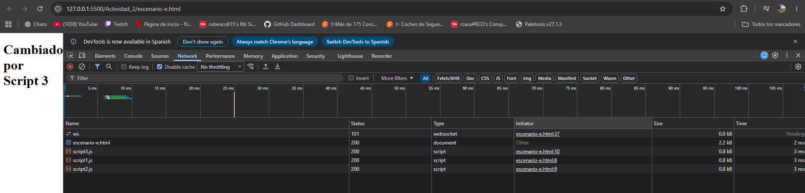

**Captura Performance:**

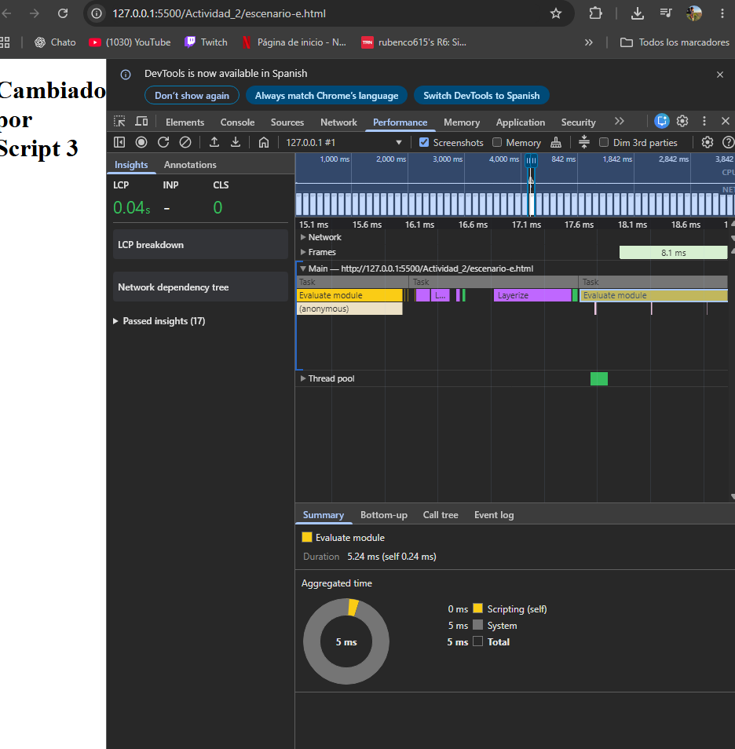

**Captura Console:**


---

## 3. Análisis general de Network

La pestaña **Network** permite comprobar qué recursos solicita el navegador, cuándo comienzan a descargarse y cuánto tarda cada petición.

En los cinco escenarios se observa la carga del documento HTML y de los tres archivos JavaScript (`script1.js`, `script2.js` y `script3.js`), todos ellos cargados correctamente con estado HTTP `200`.

La principal diferencia entre los escenarios no está únicamente en la descarga de los archivos, sino en **cuándo se permite ejecutar JavaScript respecto al procesamiento del HTML**:

- El script tradicional situado en el `<head>` puede detener el análisis del HTML mientras se ejecuta.
- Los scripts situados al final del `<body>` se encuentran cuando el contenido HTML anterior ya ha sido procesado.
- `async` permite una carga independiente, pero ejecuta cada script cuando está disponible y no garantiza el orden.
- `defer` permite descargar los archivos durante el procesamiento del HTML, pero retrasa su ejecución y conserva el orden.
- `type="module"` utiliza por defecto un comportamiento de ejecución diferida y añade las características propias de los módulos ES6.

Las capturas de Network complementan las mediciones realizadas en **Performance** y los resultados observados en **Console**, permitiendo analizar tanto la carga de los recursos como su efecto posterior sobre el DOM.

---

## 4. Cuadro Comparativo de Resultados

| Escenario | Ubicación / Atributo | Descarga / comportamiento observado en Network | ¿Pantalla en blanco? | ¿Acceso al DOM? | Orden Garantizado | Ámbito |
|:---:|---|---|:---:|:---:|:---:|:---:|
| **A** | `<script>` en `<head>` | Scripts solicitados desde el `<head>`; su ejecución bloquea el parser | Sí (retraso alto) | **Falla** | Sí (1 → 2 → 3) | Global (`window`) |
| **B** | `<script>` antes de `</body>` | Scripts encontrados al final del `<body>` | No (pinta primero) | **Éxito** | Sí (1 → 2 → 3) | Global (`window`) |
| **C** | `<script async>` en `<head>` | Descarga independiente durante el procesamiento del HTML | No en descarga | **Inestable** | No | Global (`window`) |
| **D** | `<script defer>` en `<head>` | Descarga durante el procesamiento del HTML | No (pinta primero) | **Éxito** | Sí (1 → 2 → 3) | Global (`window`) |
| **E** | `<script type="module">` | Descarga como módulos durante el procesamiento del HTML | No (pinta primero) | **Éxito** | Sí (1 → 2 → 3) | **Aislado** |

---

## 5. Conclusión

1. En el **Escenario A** el script falla porque se ejecuta antes de que exista el DOM, dejando la página congelada en blanco por el bloqueo del parser.
2. Colocar los scripts al **final del body** o usar **`defer`** soluciona el problema porque garantiza que el DOM ya existe cuando corre el código.
3. **`async`** no asegura el orden ni espera al DOM, mientras que **`type="module"`** es la opción moderna porque aplica `defer` por defecto y aísla las variables para no contaminar el entorno global.
